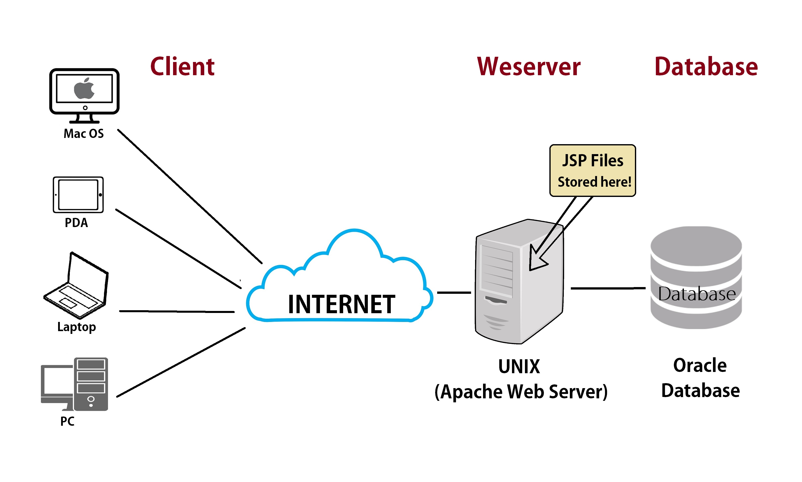
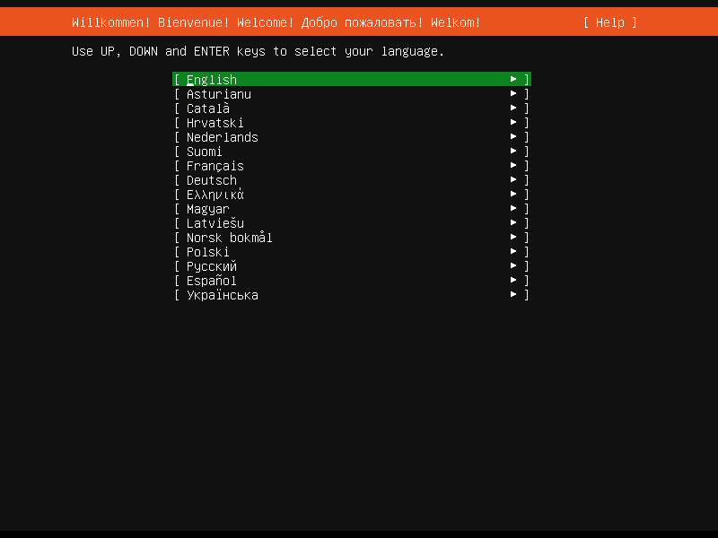

# Deliverable 1
 > Tutorial can be found [here](https://www.digitalocean.com/community/tutorials/how-to-install-the-apache-web-server-on-ubuntu-22-04)

## Concepts I don't understand:

 

* Virtual Host - A virtual host, in short, is the way that websites can take multiple people. Servers are differentiated by their host name that then creates their own domain through their IP address.

### What is a web server?

A web server in the hardware department acts as a computer that stores web server software and a website's component files like HTML, CSS or JavaScript. The sever is able to connect to the internet and support physical data interchange with other devices surfing the net.
On the software side it controls how we users access hosted files through web addresses, obtaining IP to send to their own virtual host. 

### What are some different web server applications? 

Web servers can understand URLs and create protocols with other devices to physically manipulate data to make a seamless experience for the user.

### What is virtualization? 

Virtualization is the usage of a server to create the experience of using a different kind of hardware on your monitor without changing your original OS. An example would be how we work with VirtualBox use the Linux Operating System.

### What is virtualbox?

)

Virtualbox is a popular cross-platform virtualization software that can run multiple operating systems. Such as Mac OS X, Microsoft Windows and as previous mentioned Linux.

### What is a virtual machine?

A virtual machine uses software instead of hardware to run programs and deploy apps. For example our cloud monitors at the school run the WIndows operating system despite not having any physical CPU, ALU or GPU.

### What is Ubuntu Server?

A Ubuntu Server is a variant of the standard Ubuntu, tailored for networks and services. If anything it is the hired muscle with specified talents in web service. 

### What is a firewall? 

A firewall is a network security device that monitors web traffic to or from devices. THis tool makes sure that to many requests aren't coming from the same host or IP address. For this reason, many hackers when using a DDOS attack use zombie-bots to send a lot of traffic to website as they go undetected. 

### What is SSH?

A SSH or Secure Shell is a network communication protocol that enables two computers, in this case our sever and a laptop, to communicate with each other and share data. Think of it as a game of air hockey, you need two people to play, and the SSH key is the game that allows both players to hurl insults.

