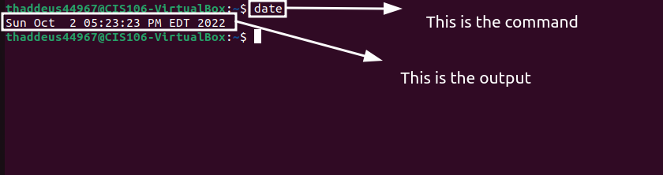

# Lab 3 Submission 

## Question 1
Has no submission 

## Question 2

| Program Purpose    | Package Name | Version |
|------------------- | ------------ | ------- |
| Play A Tetris Game |blockattack           | 2.7.0-1 amd64
| Play A Video File  |dragoplayer            | 4:21/12/3-Oubuntu amd64|
| Browse the internet | epiphany-browser | 42.4-Oubuntu amd64|
| Read your email | geary | 40.0-2 amd64|
| Play Music | ario | 1.6-1.1 amd64|

1. Which command did you use to install? 
apt list --installed
2. Which command did you use to remove? 
apt list --remove
3. Which command will you use to install and remove?
sudo apt install package+ package-

| command | what it does |
|---------|------|
| echo | display a line of text|
| fortune | print a random, hopefully interesting, adage|
| cowsay | configurable speaking/thinking cow (and a bit more)|
| lolcat | rainbow coloring effect for text console display|
| figlet | display large characters made up of ordinary screen characters|
| toilet | display large colourful characters|
| rig | Random Identity Generator|
