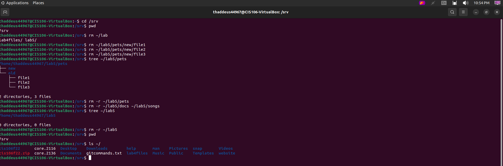

## Question 1: Creating Files and Directories

## Question 2: Removing Files and Directories

## Question 3: Moving Files and Directories

## Question 4: Copying Files and Directories 

## Challenge Question

