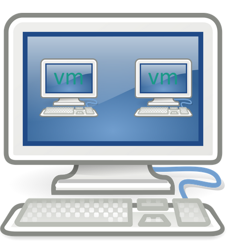
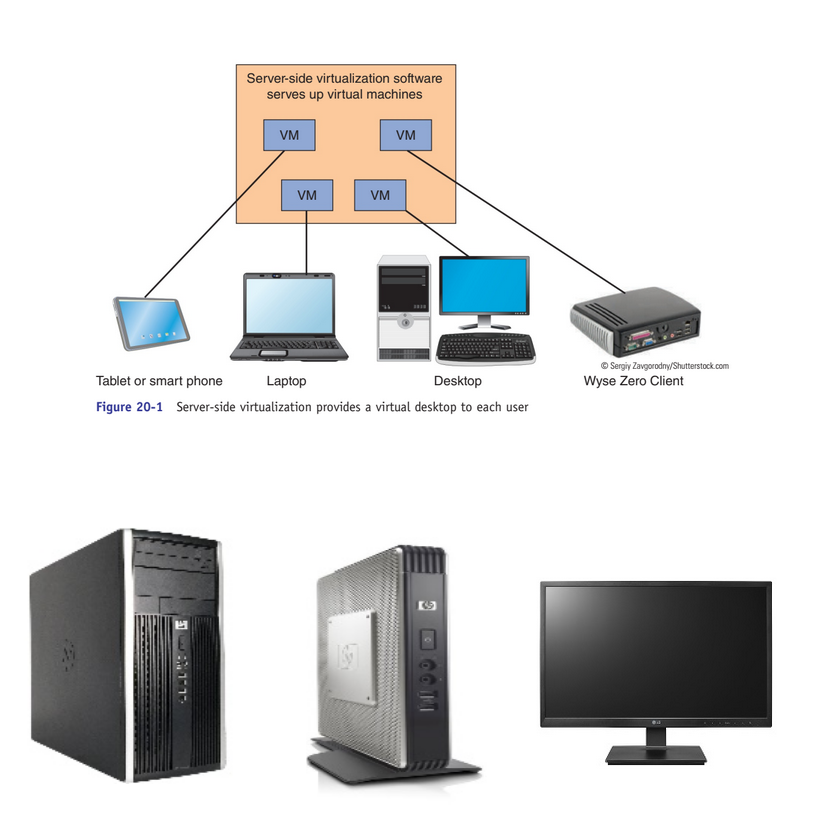
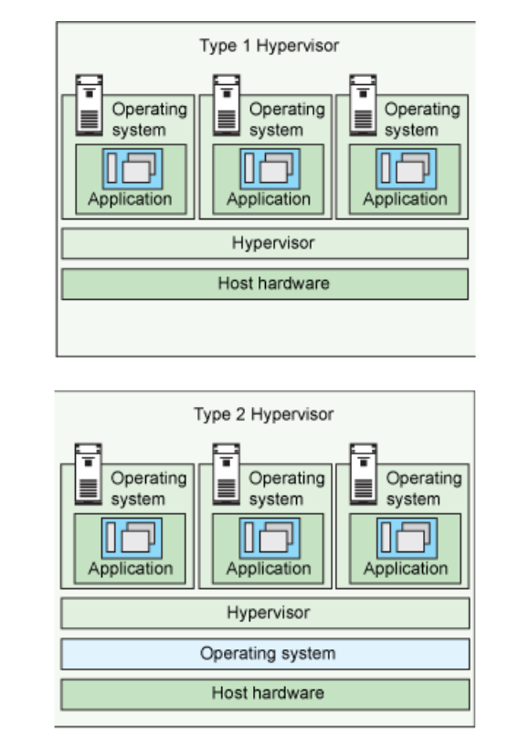

--- 
Name: Thaddeus Chestnut Jr.
Semester: Fall 22
Class: CIS 106 Linux Fundamentals 
---

# Week Report 2

# Basics of Virtualization

1. **What is Virtualization**
Virtualization is the replication of hardware to stimulate a virtual machine inside a physical machine. An example of virtualization would be the dummy monitor's throughout PCCC that are able to use RAM and preform downloads without having any hardware, accomplished through servers found somewhere on campus.

Furthermore, there are two general types of virtualization server-side virtualization and client-side virtualization; the difference being where the virtualization takes place. In the case of server-side virtualization, we take a server and spread the influx of data in the cloud between three devices determined by local storage capacity zero client, thin client and thick client. 

Whereas client-side virtualization takes place on software installed on the computer acting as a host for managing virtualization; a example being our usage of virtualbox.

Oftentimes these two catagories are separated to the simplified terms of Type 1 and Type 2.

# Installing Ubuntu in Virtualbox
