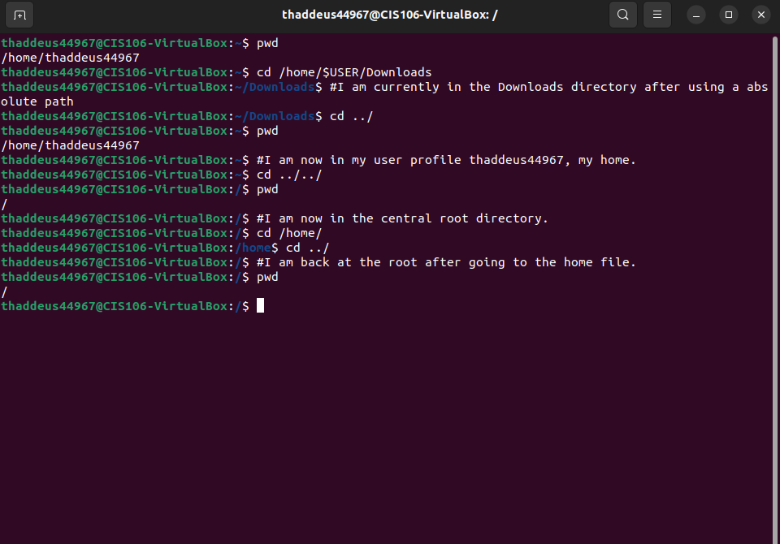

## Homework 4
1. Complete Discussion 3: The Rise of Open Source
2. Complete week report
*Week Report must contain the following:*
>If you need a refresher on the filesystem and the commands to navigate the filesystem, watch these videos. Otherwise, skip this part:

1. Do all the practice exercises in the presentation. After completing each practice, take a screenshot of the terminal and put it in your weekly report. One screenshot per practice is enough to prove you did them.

2. Create a table that includes the following directories and their usage. All the information can be found in the presentation:

Command | Usage
--------|-------
bin     | The essential commands
dev     | Device files
etc     | System configuration files
home    | User home directories
media   | Mount point for removable media, such as DVDs and floppy disks
opt     | Add-on software packages
proc    | Kernel information, process control, system hardware information
srv     | Information relating to services that run on the system
usr     | Software not essential for system operation, such as applications
var     | Dedicated to variable data, such as logs, databases, websites, and temporary spool (e-mail etc.) files that persist form one boot to the next.

1. Create a table of the commands used for navigating the file system. You have to use code formatting in your markdown just like teh example. Your table must include the following:
* The command,
* what the command does, 
* the syntax/formula of how to use the commands, 
* an example of the command in use.
>You can get all of the information from the presentation

Command | What it does | Syntax| Example 
--------|--------------|-------|--------
pwd     | It shows the present working directory | pwd `OPTION` | pwd -L
cd      | Changes directory | cd  `<dirname>` | cd /home/thaddeus44967/Downloads|
ls      | Lists all relative directory files under the present working directory | ls `<dirname> or/and OPTION` | ls /home/proc/sys/net | 

1. From The Presentation, include the following
* The summary must include the following: 
* Definitions of the following terms 
* File System 
* Current directory
* Parent directory 
* The difference between **YOUR HOME** directory and **THE HOME** directory 
* pathname
* relative path 
* absolute path
* A bulleted list of all the commands are used for navigating the filesystem.

>  Linux is a big file! Every thing we use in linux is part of a huge child folder under the root of the operating system. The way we can move through this huge assortment of files is using the file system (as seen above). Using this system we can separate files to two catagories: child and parent. Parent folders are normally files present in your working directory that you can move between. Inside of these files are their relatives or children that you can then move on through. A absolute path uses everything from the start of your root to move directly from file to file regardless sof current position. A example would be if I want to get locale form ipv4, I would use `cd /boot/grub/locale`. However, you can also use relative pathways were you move form a folder to another in relation to your current position. A example would be that I am in sys file and want to move to net, I use cd `/sys/net`. Also, the difference between **YOUR HOME** and **THE HOME** is that **YOUR HOME** is the starting point form your usr profile whereas **THE HOME** shows all of the usr profiles and is the view of the administrator delegating homes to other usrs. Bullet list of navigating command:
> * pwd: print working directory
> * cd: change directory
> * ls: list