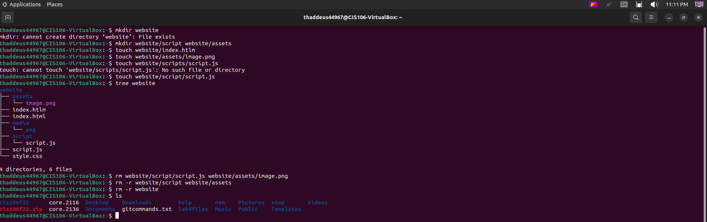
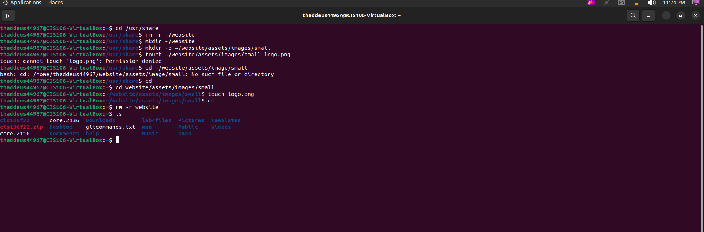
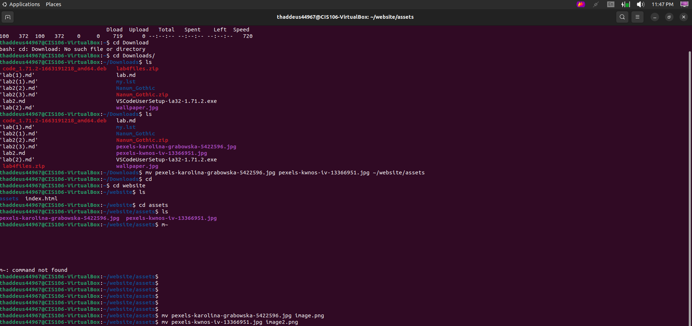
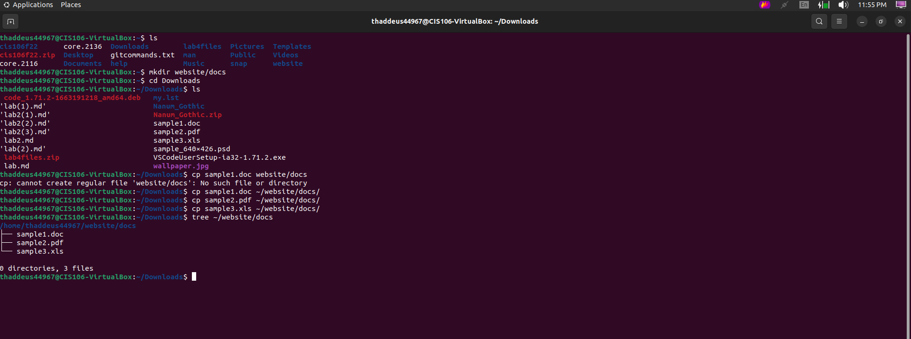

## Weekly Report
### What are Command Options?
>Command Options, are commonly something that allows your command to perform a specific wanted action

### What are Command Arguments?
>Command Arguments is the thing you want your command to execute, like a file.

### Which command is used for create directories? Provide at least 3 examples.
> The `mkdir` is used to create directories. 3 examples being: 
> * `mkdir name`
> * `mkdir name/your_name`
> * `mkdir ~/doom_eternal`

### What does the touch command do? Provide at least 3 examples.
> The touch command creates files in directories. 3 examples being:
> * `touch hello/hi.txt`
> * `touch hi.txt cat.png`
> * `touch Downloads/pictures/cat/snowball.jpg`

### How do you remove a file? Provide an example.
> You remove a file bu using the `rm` command. A example being: 
> * `rm ~/dummy/bye_dummy.txt`

### How do you remove a directory and can you remove non-empty directories in Linux? Provide an example.
> You remove a directory by using the `rmdir` command or `rm -r` command. You can not remove a non-empty directory in Linux. A example would be:
> `rmdir ~/dummy`
> `rm -r ~/dummy`

### Explain the mv and cp command. Provide at least 2 examples of each.
>The mv command can change a file name or move a file. 2 examples are:
> * `mv dummy.txt smart.txt`
>  * `mv ~/Documents/dummy.txt ~/Downloads`
> 
>The cp command copies thing into other directories for instance: 
> * `cp dummy.txt`
> * cp `~/Documents/dummy.txt ~/Downloads`

### Practice

