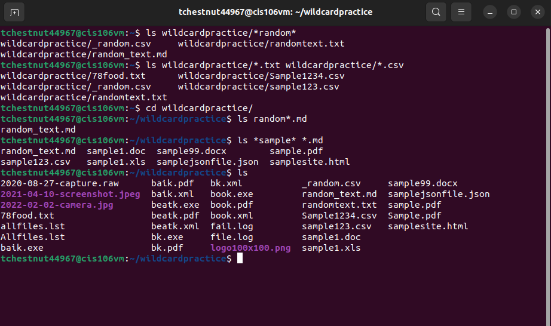
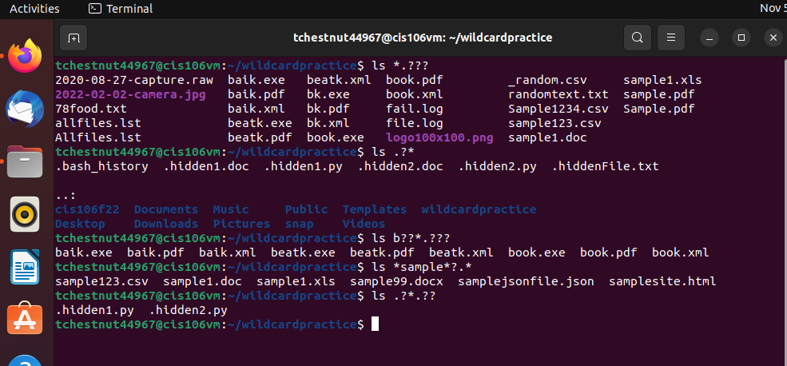
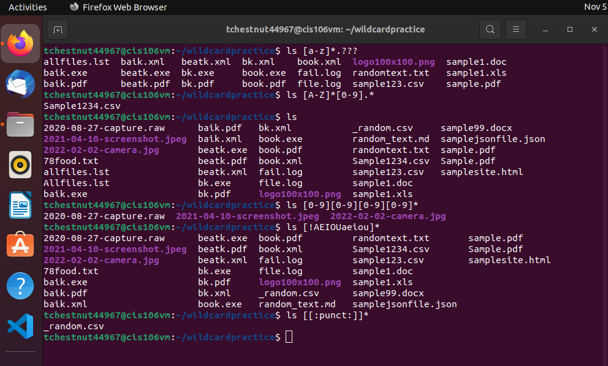

--- 
Name: Thaddeus 
Course: CIS 106 Linux Fundamentals 
Semester: Fall 2022
---
## Wildcards 
> * \* - ignores everything and looks for an number of characters.
> * ? - only specifies if one character is there
> * [] - searches for the parameters defined by the user.

Examples: 
` ls ~/cis106f22/Labs/Lab_1/*.md` Finds any markdown file regardless of name.

` ls ~/cis106f22/Labs/Lab_1/.?*.*` Searches for any hidden files that have a single character after the period regardless of extension.

` ls ~/cis106f22/Labs/Lab_1/[a-z]*.* ` Lists any file that begins with a lowercase letter regardless of file extension.

## Practice 
### Practice 5

### Practice 6

### Practice 

